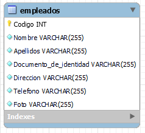

# employees_manager

The application is an API whose purpose is to connect to a mysql database to perform a CRUD on a table called Employee within an employees database to allow the management of this information to a fronted application on the web or desktop through the HTTP protocol, in this way companies interested in managing the data of their employees such as their names, surnames, address, email and telephone number among other data will be able to use the API if it satisfies their needs for the management of their employees' information.

---

## Manuals and other information

* [User manual](./docs/user_manual.md)
* [Technical manual](./docs/technical_manual.md)
* [API docs](./docs/api_docs.md)
* [License](./docs/licence.md)
* [Notice](./docs/NOTICE.md)

## ER diagram

## Usage

Executed the *docker-compose.yml* in the terminal with `docker-compose up -d` or `podman-compose up` dependen of your container tool.
